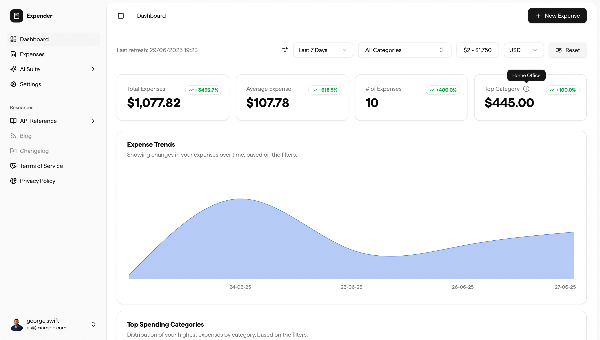
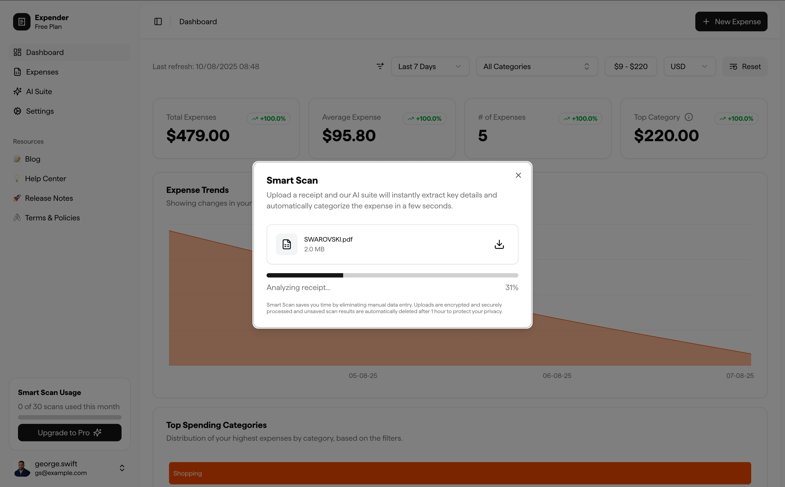

# Expender - Smart Expense Management Web Application

A comprehensive web application for expense tracking and management, built with Next.js and seamlessly integrated with the [Expender serverless backend](https://github.com/george-swift/expender-backend). Expender combines modern UI/UX design with powerful AI-driven receipt scanning capabilities to make expense management effortless and intuitive.



## ✨ Features

### 🎨 Modern User Interface

- **Responsive Design**: Mobile-first approach ensuring optimal experience across all devices
- **Dark/Light Themes**: System preference detection with manual theme switching
- **Modern UI Components**: Built with Radix UI primitives and styled with Tailwind CSS
- **Accessible Design**: WCAG 2.1 compliant with keyboard navigation and screen reader support
- **Smooth Animations**: Buttery-smooth transitions, micro-interactions and navigation

### 🔐 Authentication & Security

- **Clerk Integration**: Secure authentication with support for email, social logins, and passkeys
- **JWT Token Management**: Seamless token refresh and secure API communication
- **Multi-Factor Authentication**: Optional 2FA for enhanced account security
- **Account Management**: Profile editing, passkey management, and secure account deletion

### 💰 Expense Management

- **CRUD Operations**: Create, read, update, and delete expenses with intuitive forms
- **Batch Operations**: Create multiple expenses simultaneously for bulk data entry
- **Smart Categorization**: Pre-defined categories with custom category support in the works
- **Multi-Currency Support**: Handle expenses in 18+ global currencies
- **Data Filtering**: Filter expenses by categories and custom date and amount ranges

### 📊 Data Visualization & Analytics

- **Interactive Dashboard**: Real-time expense analytics with interactive charts
- **Spending Trends**: Visual representation of spending patterns over time
- **Category Breakdown**: Area charts and bar graphs showing expense distribution
- **Export Capabilities**: CSV export with customizable field selection
- **Responsive Charts**: Recharts-powered visualizations that adapt to screen size

### 🤖 SmartScan Technology

- **AI-Powered Receipt Scanning**: Upload receipt images for automatic data extraction
- **Real-Time Processing**: GraphQL subscriptions for live scan result updates
- **Multi-Format Support**: Process JPEG, PNG, and PDF receipts up to 5MB
- **Intelligent Categorization**: AI-powered expense categorization based on merchant data
- **Review & Edit**: Pre-filled forms allow review and editing before saving



### ⚡ Performance & Optimization

- **Next.js 15**: Latest framework features including App Router and Server Components
- **Image Optimization**: Automatic image optimization and lazy loading
- **Code Splitting**: Automatic route-based code splitting for optimal loading
- **Caching Strategy**: Intelligent caching for improved performance

## 🛠 Tech Stack

### Core Framework

- **[Next.js 15](https://nextjs.org/)**: React framework with App Router
- **[React 19](https://react.dev/)**: Latest React with concurrent features
- **[TypeScript](https://www.typescriptlang.org/)**: Type-safe JavaScript
- **[Tailwind CSS 4](https://tailwindcss.com/)**: Utility-first CSS framework

### UI & Components

- **[Radix UI](https://www.radix-ui.com/)**: Accessible component primitives
- **[shadcn/ui](https://ui.shadcn.com/docs)**: Beautifully-designed, accessible components
- **[Lucide React](https://lucide.dev/)**: Beautiful, customizable icons
- **[Recharts](https://recharts.org/)**: Composable charting library
- **[React Hook Form](https://react-hook-form.com/)**: Performant forms with validation
- **[Zod](https://zod.dev/)**: TypeScript-first schema validation
- **[Lenis](https://lenis.darkroom.engineering/)**: Butter-smooth navigation on scroll.

### State & Data Management

- **[TanStack Table](https://tanstack.com/table/)**: Powerful table and data grid
- **[nuqs](https://nuqs.47ng.com/)**: Type-safe URL state management
- **[AWS Amplify](https://aws.amazon.com/amplify/)**: GraphQL subscriptions for real-time updates
- **[Axios](https://axios-http.com/)**: HTTP client for API communication

### Authentication & Observability

- **[Clerk](https://clerk.com/)**: Complete authentication and user management
- **[Sentry](https://sentry.io/)**: Error monitoring and performance tracking

### Development Tools

- **[ESLint](https://eslint.org/)**: Code linting and quality enforcement
- **[Prettier](https://prettier.io/)**: Code formatting and style consistency
- **[Husky](https://typicode.github.io/husky/)**: Git hooks for code quality
- **[Commitlint](https://commitlint.js.org/)**: Conventional commit message enforcement

## 📋 Prerequisites

Before setting up the application locally, ensure you have the following installed:

- **Node.js 18.17+**: Download from [nodejs.org](https://nodejs.org/)
- **pnpm**: Install globally with `npm install -g pnpm`
- **Git**: For version control and repository management
- **Modern Browser**: Chrome, Firefox, Safari, or Edge (latest versions)

### Required External Services

- **Clerk Account**: For authentication ([clerk.com](https://clerk.com/))
- **Backend Services**: The [Expender backend](https://github.com/george-swift/expender-backend) must be deployed and accessible

## 🚀 Installation & Setup

### 1. Clone the Repository

```bash
git clone https://github.com/george-swift/expender.git
cd expender
```

### 2. Install Dependencies

```bash
pnpm install
```

### 3. Environment Configuration

Copy the example environment file and configure your variables:

```bash
cp .env.example .env.local
```

Edit `.env.local` with your configuration:

```bash
# Clerk Authentication
NEXT_PUBLIC_CLERK_PUBLISHABLE_KEY=pk_test_...
CLERK_SECRET_KEY=sk_test_...

# Clerk URLs (adjust ports as needed)
NEXT_PUBLIC_CLERK_SIGN_IN_URL=/sign-in
NEXT_PUBLIC_CLERK_SIGN_UP_URL=/sign-up
NEXT_PUBLIC_CLERK_SIGN_IN_FORCE_REDIRECT_URL=/dashboard
NEXT_PUBLIC_CLERK_SIGN_UP_FORCE_REDIRECT_URL=/dashboard

# AWS AppSync (for SmartScan real-time updates)
NEXT_PUBLIC_APPSYNC_GRAPHQL_ENDPOINT=https://your-appsync-endpoint.amazonaws.com/graphql
NEXT_PUBLIC_AWS_REGION=us-east-1

# Sentry (optional - for error monitoring)
NEXT_PUBLIC_SENTRY_DSN=https://your-sentry-dsn@sentry.io/project-id
NEXT_PUBLIC_SENTRY_ORG=your-org
NEXT_PUBLIC_SENTRY_PROJECT=your-project
SENTRY_AUTH_TOKEN=your-auth-token

# Backend API Endpoints
API_BASE_URL=https://your-backend-api-url.com
CDN_BASE_URL=https://your-cloudfront-cdn-url.com
```

### 4. Start Development Server

```bash
pnpm dev
```

Open [http://localhost:3000](http://localhost:3000) to view the application.

## 🔧 Development Workflow

### Available Scripts

```bash
# Development
pnpm dev          # Start development server
pnpm build        # Build production application
pnpm start        # Start production server
pnpm lint         # Run ESLint for code quality
pnpm lint:fix     # Fix auto-fixable ESLint issues

# Git Hooks (automated)
pnpm prepare      # Set up Husky git hooks
```

### Code Quality & Standards

The project enforces code quality through:

- **ESLint**: Configured with Next.js and accessibility rules
- **Prettier**: Consistent code formatting with import sorting
- **TypeScript**: Strict type checking for better code reliability
- **Husky**: Pre-commit hooks for linting and formatting
- **Commitlint**: Conventional commit message format enforcement

### Development Best Practices

1. **Component Structure**: Use the established component patterns in `/src/components`
2. **Type Safety**: Always define proper TypeScript interfaces and types
3. **Accessibility**: Ensure all interactive elements are keyboard accessible
4. **Performance**: Use React.memo, useMemo, and useCallback appropriately
5. **Error Handling**: Implement proper error boundaries and user feedback
6. **Testing**: Write unit tests for utility functions and integration tests for key flows

## 🏗 Architecture Overview

### Directory Structure

```
src/
├── app/                    # Next.js App Router pages and layouts
│   ├── (auth)/            # Authentication routes
│   ├── (dashboard)/       # Protected dashboard routes
│   ├── actions/           # Server actions
│   └── providers/         # Context providers
├── components/            # Reusable UI components
│   ├── ui/               # Base UI components (Radix + Tailwind)
│   └── *.tsx             # Feature-specific components
├── fonts/                # Custom font files
├── graphql/              # GraphQL queries and subscriptions
├── hooks/                # Custom React hooks
├── lib/                  # Utility functions and configurations
│   ├── utils.ts          # Common utility functions
│   └── validations/      # Zod schema validations
├── styles/               # Global styles and Tailwind config
└── types/                # TypeScript type definitions
```

### Integration with Backend

The frontend communicates with the backend through:

1. **REST API**: Expense CRUD operations, user management, file uploads
2. **GraphQL Subscriptions**: Real-time SmartScan result updates
3. **JWT Authentication**: Clerk tokens for secure API access
4. **File Uploads**: Direct S3 uploads with presigned URLs

### State Management Strategy

- **Client State**: React hooks and context for UI state
- **URL State**: nuqs for shareable filter and pagination state
- **Form State**: React Hook Form for complex form handling

## 🚀 Deployment

### Vercel Deployment (Recommended)

1. **Connect Repository**: Link your GitHub repository to Vercel
2. **Configure Environment**: Add all environment variables in Vercel dashboard
3. **Deploy**: Push to main branch triggers automatic deployment

```bash
# Manual deployment
npx vercel
```

### Custom Deployment

For custom hosting environments:

```bash
# Build the application
pnpm build

# Start production server
pnpm start
```

### Environment-Specific Configuration

- **Development**: Uses `.env.local` for local overrides
- **Preview**: Vercel preview deployments use preview environment variables
- **Production**: Production environment variables set in Vercel dashboard

## 🔗 API Integration

### Backend Dependencies

This frontend requires the [Expender Backend](https://github.com/george-swift/expender-backend) to be deployed and accessible. Key integration points:

- **Authentication**: Clerk JWT tokens validated by backend
- **Expense API**: Full CRUD operations with filtering and export
- **SmartScan API**: File upload and processing coordination
- **User Management**: Quota tracking and account lifecycle

### Error Handling

- **Network Errors**: Automatic retry with exponential backoff
- **Authentication Errors**: Automatic token refresh and login redirect
- **Validation Errors**: User-friendly form error messages
- **Server Errors**: Graceful degradation with error boundaries

## 🛠 Troubleshooting

### Common Issues

#### 1. Development Server Issues

**Port Already in Use:**

```bash
# Kill process on port 3000
npx kill-port 3000

# Or start on different port
pnpm dev -- --port 3001
```

#### 2. Authentication Issues

**Clerk Configuration:**

- Verify `NEXT_PUBLIC_CLERK_PUBLISHABLE_KEY` is set correctly
- Ensure Clerk application domain matches your local/deployed URL
- Check that redirect URLs are configured in Clerk dashboard

**Token Validation Errors:**

- Confirm backend is accessible and properly configured
- Verify JWT tokens are being sent with API requests
- Check browser network tab for authentication errors

#### 3. Build Issues

**TypeScript Errors:**

```bash
# Check types without building
npx tsc --noEmit

# Fix auto-fixable issues
pnpm lint:fix
```

**Environment Variables:**

- Ensure all required environment variables are set
- Check that sensitive variables are not exposed to client-side

#### 4. SmartScan Issues

**GraphQL Subscription Failures:**

- Verify `NEXT_PUBLIC_APPSYNC_GRAPHQL_ENDPOINT` is correct
- Check AWS region configuration
- Ensure backend AppSync is deployed and accessible

**File Upload Errors:**

- Confirm file size is under 5MB limit
- Check supported formats: JPEG, PNG, PDF
- Verify presigned URL generation from backend

### Performance Optimization

1. **Bundle Analysis**: Use `@next/bundle-analyzer` to identify large bundles
2. **Image Optimization**: Ensure images use Next.js Image component
3. **Code Splitting**: Leverage dynamic imports for non-critical components
4. **Caching**: Configure appropriate cache headers for static assets

### Browser Compatibility

**Supported Browsers:**

- Chrome 88+
- Firefox 85+
- Safari 14+
- Edge 88+

**Polyfills:**

- Modern browsers only (no IE11 support)
- Uses native ES2020+ features
- Requires JavaScript for full functionality

## 🤝 Contributing

We welcome contributions to improve Expender! Please read our [Contributing Guidelines](CONTRIBUTING.md) for detailed information on:

- Development setup and workflow
- Code style and conventions
- Testing requirements
- Pull request process
- Community guidelines

### Quick Start for Contributors

1. Fork the repository
2. Create a feature branch: `git checkout -b feature/amazing-feature`
3. Make your changes and test thoroughly
4. Commit using conventional commits: `git commit -m "feat: add amazing feature"`
5. Push and create a Pull Request

## 📄 License

This project is licensed under the MIT License - see the [LICENSE.md](LICENSE.md) file for details.

## 🆘 Support

- **🐛 Bug Reports**: Use the [issue templates](.github/ISSUE_TEMPLATE/)
- **💬 Discussions**: [GitHub Discussions](../../discussions) for questions and ideas
- **📧 Email**: [support@expender.app](mailto:support@expender.app) for direct support
- **🔒 Security**: [security@expender.app](mailto:security@expender.app) for security issues

## 🔗 Related Projects

- **[Expender Backend](https://github.com/george-swift/expender-backend)**: Serverless API and infrastructure
